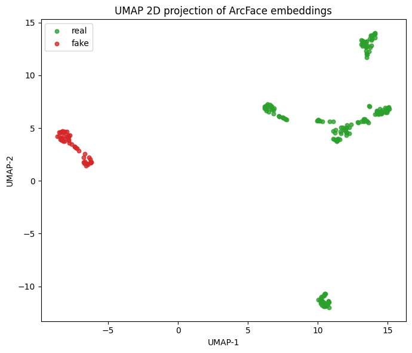
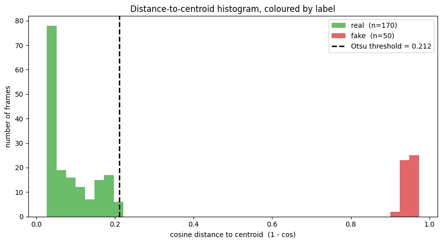

# Deepfake detection by latent-space outlier detection

Detect face-swap deepfakes in a video by encoding every frame into the **ArcFace
512-D identity space** ([insightface](https://github.com/deepinsight/insightface))
and finding the tampered frames as **outliers**.

The experiment takes one real clip, swaps a different identity into **only a short
segment of frames** (so most of the video is genuine and a small part is fake), and
then localizes the fake segment with a single, simple signal: **cosine distance to the
identity centroid + a basic (Otsu) threshold**.

## How it works

1. **Generate** — `inswapper` pastes identity *B* into frames `[99, 149)` of a clip of
   person *A* → one `manipulated.mp4` that is mostly genuine with a fake segment.
2. **Encode** — each frame → largest face → `normed_embedding` (ArcFace IResNet-50,
   512-D, unit length). The notebook includes a section on the **encoder architecture**
   (SCRFD alignment → IResNet-50 backbone → L2-normalized embedding, and why the
   ArcFace angular-margin loss makes identities cluster).
3. **Visualize** — a **UMAP** 2-D projection of the embeddings (right after encoding)
   shows the genuine and swapped frames as separate clusters before any detector runs.
4. **Detect** — take the centroid of the genuine majority (trimmed mean), score each
   frame by `1 - cos(x, centroid)`, threshold with Otsu. Genuine frames sit near 0;
   swapped frames jump toward 1. The verdict is rendered back onto the video with face
   boxes + keypoints right under the detection step.

## Result on the sample clip

| metric | value |
|---|---|
| frames | 220 (50 fake = 23%) |
| ROC-AUC | **1.000** |
| Average precision | **1.000** |
| precision / recall @ Otsu(0.212) | 98% / 100% |

The male→female swap is a large identity shift with a hard cut, so the two clusters
separate perfectly — see the distance histogram below. Harder cases (same-gender
swaps, smooth blends, heavy compression) would lower the score; that is discussed in
the notebook's *Limitations*.

The UMAP projection of the embeddings shows the two identities as separate clusters,
and the distance-to-centroid histogram is cleanly bimodal:




## Run it

```bash
pip install -r requirements.txt
jupyter lab deepfake_detection.ipynb   # Run All
```

The notebook downloads everything it needs (sample videos, the `buffalo_l` models, and
`inswapper_128.onnx` from a mirror). On a python.org macOS Python it sets
`SSL_CERT_FILE` to the `certifi` bundle so downloads don't fail with
`CERTIFICATE_VERIFY_FAILED`. Everything runs on CPU in a few minutes.

## Files

- `deepfake_detection.ipynb` — the notebook (source).
- `deepfake_detection_executed.ipynb` — the same notebook **with outputs** (plots,
  metrics, embedded results).
- `outputs/manipulated.mp4` — the partially-swapped video.
- `outputs/manipulated_annotated.mp4` — same video with face **boxes + 5 keypoints +
  the per-frame verdict** (green = genuine, red = flagged fake).
- `outputs/umap.png` — UMAP 2-D projection of the embeddings, coloured by label.
- `outputs/histogram.png` — distance-to-centroid histogram coloured by label.

## Ethics / license

insightface *code* is MIT, but the pretrained models and `inswapper` are
**"non-commercial research only"**. This is an educational/research experiment — only
swap faces on material you have the rights and consent to use.
